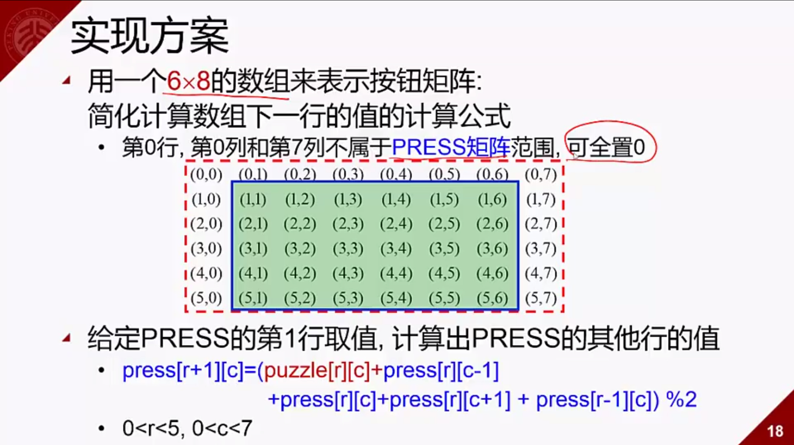
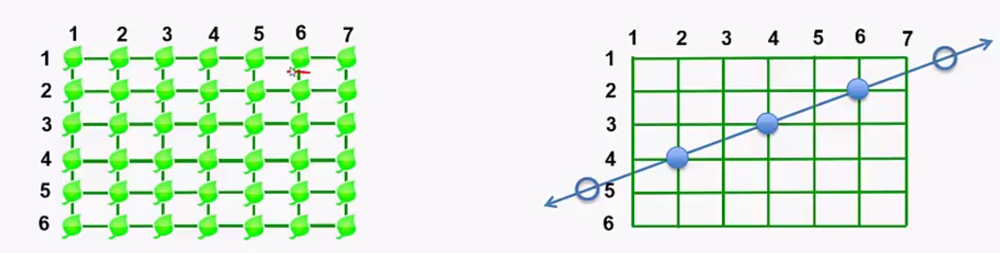
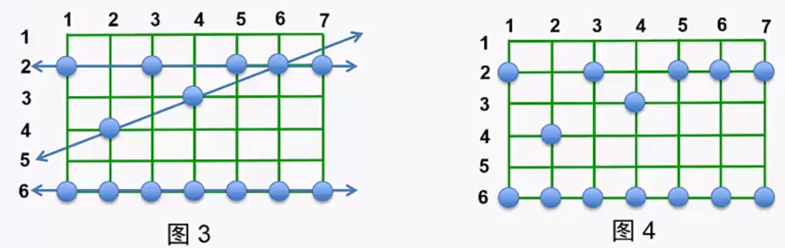
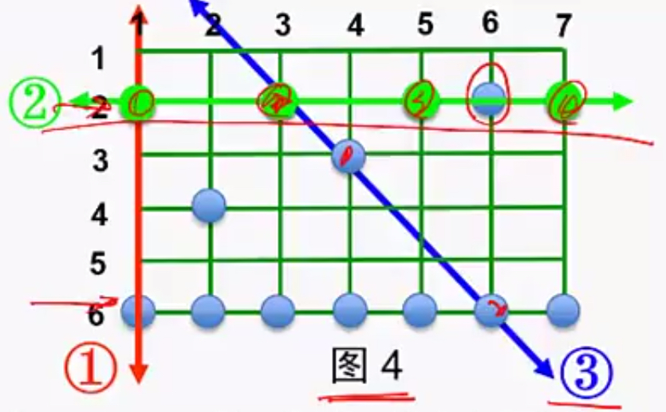

### 枚举

- 基于已有知识进行答案猜测的一种问题求解策略

- 例如：求小于N的最大素数

- 找不到数学公式，使得根据N就可以计算出这个素数

- N-1是素数？N-2是素数？...

- N-K是素数的必要充分条件：

  > N-K不能被任何一个大于1，小于N-K的素数整除$\longrightarrow$判断N-K是否是素数$\longrightarrow$转化为求小于N-K的全部素数

- 解决办法

  - 2是素数，记为$$PRIM_0$$
  - 根据$$PRIM_0$$, $$PRIM_1$$, ..., $$PRIM_k$$, 寻找比$$PRIM_k$$更大的最小素数$$PRIM_{k+1}$$
  - 如果$$PRIM_{k+1}$$大于$$N$$，则$$PRIM_k$$是我们要找的素数，否则继续寻找

### 枚举的思想：猜测

- 从可能的集合中一一列举元素
  - 根据所知道的**知识**，给一个猜测的答案
  - 2是素数
- 枚举算法
  - 对问题可能解集合的每一项
  - 根据问题给定的检验条件判断哪些是成立的
  - 是条件成立的即是问题的解
- 枚举过程
  - 判断猜测的结果是否正确->2是小于N的最大素数吗？
  - 进行**新**的猜测：有**两个**关键因素需要注意
    - 猜测结果必须是前面的猜测中没有出现过的。每次猜测是素数一定比已经找到的素数大
    - 猜测的过程中要及早**排除错误的答案**。除2以外，只有奇数才有可能是素数

### 枚举中的三个关键问题

- 问题一
  - 给出合适的**解空间**，建立简洁的数学模型
  - 可能的情况是什么$\longrightarrow$**模型中变量数尽量少，它们之间相互独立**
    - “求小于N的最大素数”中的条件是“不能被[2,n)中任意一个**素数**整除”
    - 而不是“n不能被[2,n)中任意一个**整数**整除”
- 问题二
  - **减少搜索的空间**
  - 利用知识缩小模型中个变量的取值范围，避免不必要的计算->减少代码中循环体执行次数
    - 除2之外，只有**奇数**才有可能是素数
- 问题三
  - **采用合适的搜索顺序**
  - 搜索空间的遍历顺序要与模型中条件表达式一致
    - 对$$\{2, 2*i+1 | 1\leq i, 2*i+1<n\}$$按照从小到大的顺序排列

### 一些枚举问题

- **百鸡百钱问题**

  - 鸡翁一值钱五，鸡母一值钱三，鸡雏三值钱一。百钱买百鸡，问鸡翁，鸡母，鸡雏各几何 -- 张邱建《算经》
  - 求解方法：
    - 先构造可能的解集合$$S=\{(X,Y,Z)|0\leq X,Y,Z\leq 100\}$$，X，Y，Z分别代表买公鸡，母鸡和小鸡的只数
    - 然后验证条件$$X+Y+Z=100, 5X+3Y+Z\div 3=100$$
    - 复杂度：$$O(100^2)$$
  - 程序实现

  ```c++
  /* 伪代码 */
  for(int x = 0; x <= 100; ++x)
      for(int y = 0; y <= 100 - x; ++y){
          z = 100 - x - y;
          if(z % 3 == 0) then
              if(5*x + 3*y + z/3 == 100)
                  then(x,y,z) is solution
      }
  ```

- **熄灯问题**

  - 问题描述

    - 有一个由按钮组成的矩阵，其中每行有6个按钮，共5行
    - 每个按钮的位置上有一盏灯
    - 当按下一个按钮后，该按钮以及周围位置（上下左右）的灯都会翻转一次状态
      - 在矩阵角上只改变三盏灯的状态
      - 在矩阵边缘的按钮改变四盏灯的状态
      - 其他位置的按钮改变5栈灯的状态
    - 与一盏灯毗邻的多个按钮被按下时，一个操作会抵消另一次操作的结果
    - 对矩阵中的每盏灯设置一个初始状态
    - 请你写一个程序确定需要按下那些按钮，恰好使得所有灯都熄灭

  - 程序输入：

    - 第一行是一个正整数N，表示需要解决的案例数
    - 每个案例由5行组成，每一行包括6个数字
    - 这些数字一空格隔开，可以是0或1
    - 0表示灯的初始状态是熄灭的
    - 1表示灯的储时状态是点亮的

  - 程序输出

    - 对每个案例，首先输出一行，输出字符串“PUZZLE #m”，之中m是该案例的序号
    - 接着按照该案例的输入格式输出5行
      - 1表示需要把对应的按钮按下
      - 0表示不需要按相应的按钮
      - 每个数字以一个空格隔开

  - 解题分析

    - 第二次按下同一个按钮时，将抵消第一次按下时所产生的结果->每个按钮最多只需要按下一次
    - 各个按钮被按下的顺序对最终结果无影响
    - 对第一行中美展点亮的灯按下第二行对应的按钮，就可以熄灭第一行的全部灯
    - 如此重复下去可以熄灭第1，2，3，4行的全部灯

  - 解题分析（2）

    - 第一想法：枚举所有可能的按钮状态，对每个状态计算一下最后灯的情况，看是否都熄灭

      - 每个按钮由两种状态
      - 一共有30个开关，那么状态书是$$2^{30}$$，太多，会超时

    - 如何减少枚举的状态数目呢？

      > **基本思路**：如果存在某个局部，一旦这个局部的状态被确定，那么剩余其他部分的状态只能是确定的一种，或者是不多的n种，那么只需枚举这个局部的状态即可

  - 解题分析（3）

    - 本题是否存在这样的“局部”呢？

    - 经过观察，发现**第一行**就是这样的一个**局部**

      - 因为第一行的各开关状态确定的情况下，这些开关作用过后，将导致第一行的某些等是亮的，某些灯是灭的->按下第2行对应的按钮可以改变第一行的状态，按下第三行及以后的开关不会影响到第一行

      - 为了使第一行的灯全部熄灭，**第2行的合理开关状态就是唯一的**

      - 第二行的开关起作用后，为了熄灭第二行的的灯，第三行的合理开关状态也就是唯一的，以此类推最后一行的开关状态也是唯一的

        > **只要第一行的状态定下来，记作A，那么剩余行的情况就是确定唯一的了**
        >
        > **推算出最后一行的状态，然后观察最后一行的开关起作用后，最后一行的所有灯是否都熄灭：**
        >
        > - 如果都熄灭，那么A就是一个解的状态
        > - 如果没有都熄灭，那么A就不是解的的状态，第一行换个状态重新试试
        >
        > 所以只需枚举第一行的状态状态数是$$2^6=64$$
        >
        > **也就是说，枚举第一行的操作，检验操作完最后一行后，最后一行的灯是否能够全部灭掉**

    - 有没有状态数更少的做法？

      - 枚举第一列，状态数是$$2^5=32$$
      - 执行次数$$64*5*6$$  vs. $$32*6*5$$

  - 具体实现

    - 用一个矩阵$$puzzle[5][6]$$表示灯的初始状态

      - $$puzzle[i][j]=1$$：表示灯**$$(i,j)$$**初始时是被点亮的
      - $$puzzle[i][j]=0$$：表示灯$$(i,j)$$初始时是熄灭的

    - 用一个矩阵$$press[5][6]$$表示要计算的结果

      - $$press[i][j]=1$$：表示需要按下按钮**$$(i,j)$$**
      - $$press[i][j]=0$$：表示不需要按下按钮$$(i,j)$$

    - $$press[0]$$里放着第一行开关的状态，如何进行枚举呢？

      - 可以使用六重for循环

        ```c
        for(int a0=0; a0<2; ++a0)
            for(int a1=0; a1<2; ++a1)
                for(int a2=0; a2<2; ++a2)
                    for(int a3=0; a3<2; ++a3)
                        for(int a4=0; a4<2; ++a4)
                            for(int a5=0; a5<2; ++a5){
                                press[0][0] = a0;
                                press[0][1] = a1;
                                .....
                                .....
                            }
        ```

        

      - 也可以将矩阵的第一行看作一个固定位数二进制数，这样就可以通过自增操作++进行枚举了

    - 实现时使用小技巧简化程序，如下图：

      

    - 程序实现：

      ```c
      #include <stdio.h>
      int puzzle[6][8], press[6][8];
      bool guess(){
          int c, r;
          for(r=1; r<5; r++)
              for(c=1; c<7; c++)
                  press[r+1][c] = (
                  puzzle[r][c]+press[r][c]+press[r-1][c]+press[r][c-1]+press[r][c+1]
                  ) % 2;/* 根据press第一行和puzzle数组推算press其他行 */
          for(c=1; c<7; ++c)
              if((press[5][c-1] + press[5][c] + press[5][c+1] + press[4][c]) % 2
                  != puzzle[5][c]) /* 检查第五行是否完全熄灭 */
                  /* 第5行原来是1，就应该输出1；原来是0，就应该输出0 */
                  return false;
          return true;
      }
      void enumerate(){
          int c;
          bool res;
          for(c=1; c<7; c++)
              press[1][c]=0;
          while(guess()==false){
              /*----------------*/
              press[1][1]++;/* 加1进行下一个枚举 */
              c=1;
              while(press[1][c]>1){/* 进位处理 */
                  press[1][c] = 0;
                  c++;
                  press[1][c]++;
              /*---------------*/
              /* 两段注释之间，对press第一行的元素press[1][1]~press[1][6]的
                 各种取值情况进行枚举，依次考虑：
                 0 0 0 0 0 0
                 1 0 0 0 0 0
                 0 1 0 0 0 0
                 1 1 0 0 0 0
                 0 0 1 0 0 0
                 .
                 .
                 .
                 1 1 1 1 1 1
              */
              }
          }
          return;
      }
      int main()
      {
          int cases, i, r, c;
          scanf("%d", &cases);
          for(r=0; r<6; ++r)
              press[r][0] = press[r][7] = 0;/* 第0列第7列置零 */
          for(c=1; c<7; ++c)
              press[0][c] = 0;/* 第一行置零 */
          for(i=0; i<cases; i++){
              for(r=1; r<6; r++)
                  for(c=1; c<7; c++)
                      scanf("&d", &puzzle[r][c]);
          	enumerate();
              printf("PUZZLE #%d\n, i+1");
              for(r=1; r<6; ++r){
                  for(c=1; c<7; c++)
                      printf("%d", press[r][c]);
                  printf("\n");
              }
          }
          return 0;
      }
      ```

  - #### 总结

    - 枚举过程$$enumerate()$$
      - $$press[1][.]$$中每一个元素表示一个二进制数0/1，通过模拟二进制加法方式进行枚举
      - 需要处理进位
    - 推测验证过程$$guess()$$
      - 用$$6*8$$的矩阵来简化下一行按钮值的计算公式
      - 根据$$press[1][.]$$和$$puzzle$$数组，用公式计算**能使得1~4行所有灯熄灭的**$$press$$的其它行的值，再判断所计算的$$press$$数组能否熄灭矩阵第五行的所有灯

- **讨厌的青蛙**

  - 问题描述

    > 在韩国有一种小青蛙🐸，每到晚上，这种青蛙会在稻田里跳跃，踩踏稻子，农民早上看到被踩踏的稻子，希望找到造成最大损害的那只青蛙🐸经过的路径。
    >
    > 每一只青蛙总是沿着一条**直线**跳跃，而且**每次跳跃的距离相同**，**不同青蛙跳的步长不同**，**不同青蛙跳的方向可能不同**。
    >
    > 稻田里的稻子组成一个栅格，每棵稻子位于一个格点上面。
    >
    > 青蛙总是从稻田的一侧跳进稻田，然后沿着某条直线穿越稻田，从另一侧跳出去。
    >
    > 稻田和跳跃示意图栅格如下图：
    >
    > 
    >
    > 可能有多只青蛙从稻田穿越。
    >
    > 青蛙每一条都恰好踩在一棵水稻上，将这棵水稻拍倒。
    >
    > 有些水稻可能被多只青蛙踩踏。
    >
    > 农民所见到的是图4中的情形，并看不到图3中的直线，可见不到别人家田里被踩踏的水稻。
    >
    > 
    >
    > 而在一条青蛙行走路径的直线上，也可能会有某些被踩踏的水稻不属于该行走路径：
    >
    > - ①不是一条路径，只有两棵被踩踏的水稻，起码要有三棵才行
    > - ②是一条行走路径，但不包括$$(2,6)$$上的水稻
    > - ③不是一条行走路径，虽然有三棵被踩踏的水稻，但这三棵水稻之间的举例间隔不相等
    >
    > 
    >
    > 

  - 题目要求

    >请写一个程序，确定：
    >
    >- 在各条青蛙行走路径中，踩踏水稻最多的那一条上，有多少棵水稻被踩踏
    >- 例如，图4中答案是7，因为第6行上全部水稻恰好构成一条青蛙行走路径

  - 程序输入

    > - 从标准输入设备上读取数据
    > - 第一行上两个整数R，C，分别代表稻田中水稻的行数和列数，$1\leq R,\;C\leq 5000​$
    > - 第二行是一个整数$N$，表示被踩踏的水稻数量，$3 \leq N \leq 5000$
    > - 在剩下的N行中，每行由两个整数，分别是一棵被踩踏水稻的行号$(1 \rightarrow R)$和列号$(1 \rightarrow C)$，两个整数用一个空隔开
    > - 且每棵被踩踏水稻只被列出一次


